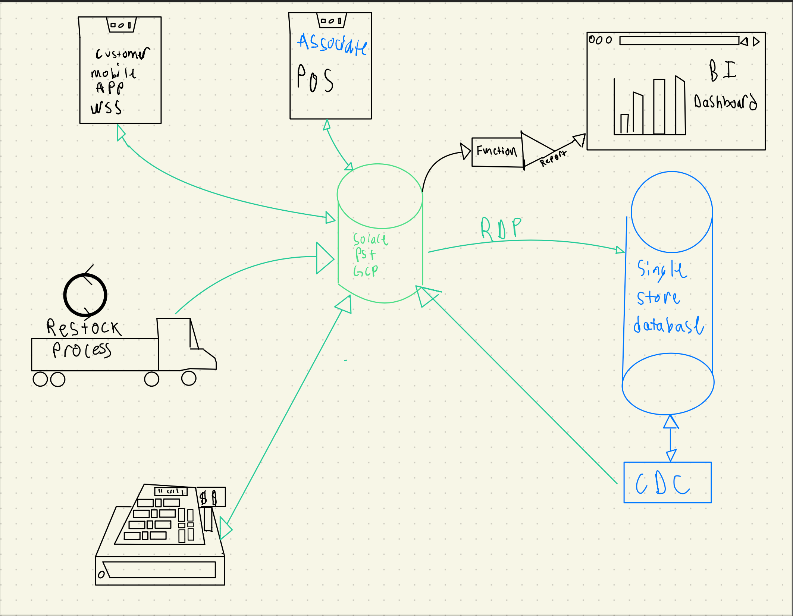

# kroger-workshop

This repo contains several microservices that will emulate a grocery store with the following activities

### In Store
- [Restocking system](./restock) - Responsible for stocking the inventory with new produce. Spring cloud streams java app.
- [POS System](./pos/) - Responsible for checking shoppers out. Spring cloud streams java app
- [Associate Device](./associate/) - Used by associates to update current inventory and receive information on inventory status. A javascript application that leverages the Solace JS SDK and MQTT

### User interaction 
- [Customer Application](./customer-app/) - Alerts customers on potential discounts. This applicaton is a javascript application that leverages Solace JS SDK to do WS. 

### Backend
- [Azure Functions](./functions/)
  - Updating PowerBI dashboard
  - Updating Azure SQL db
  - Customer also uses singleStoreDB. Could be an alternative database destination to azure sql https://www.singlestore.com/blog/spin-up-a-memsql-cluster-on-docker-desktop-in-10-minutes/
- Connectors
  - Other Solace Connectors
  - Possible .NET application

