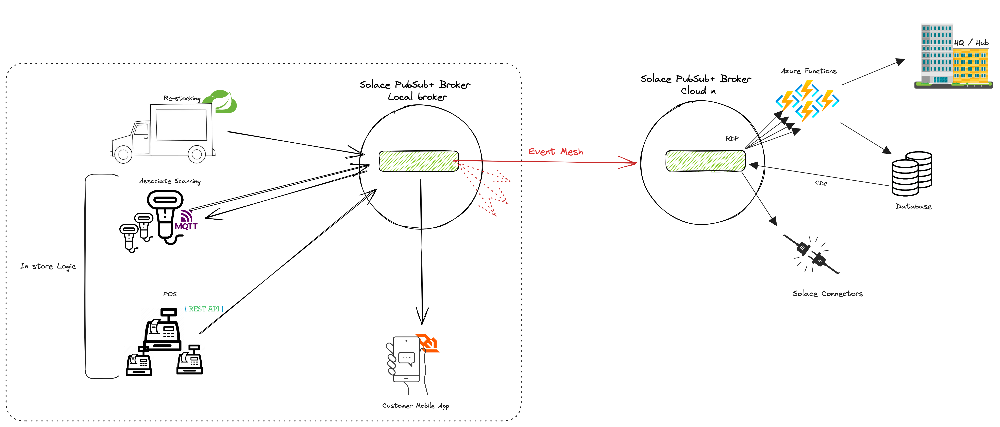

# kroger-workshop

This repo contains several microservices that will emulate a grocery store with the following activities

### In Store
- Restocking system - Responsible for stocking the inventory with new produce
- POS System - Responsible for checking shoppers out
- Associate Device - Used by associates to update current inventory and receive information on inventory status 

### User interaction 
- Customer Application - Alerts customers on potential discounts

### Backend
- Azure Functions
  - Updating PowerBI dashboard
  - Updating Azure SQL db
- Connectors
  - Other Solace Connectors

